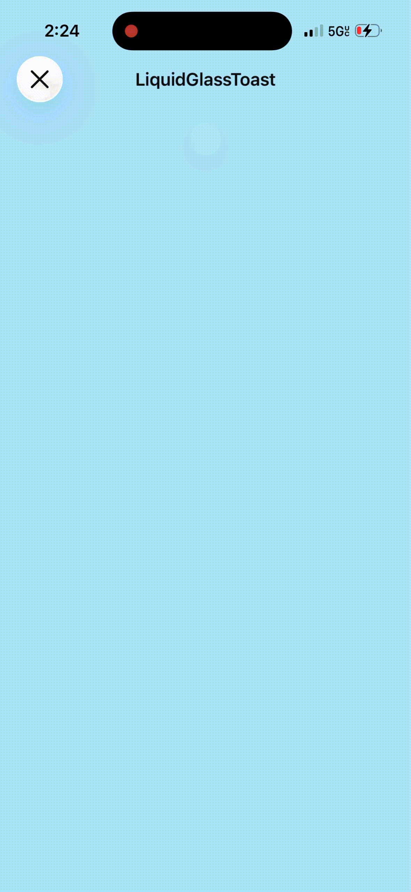

# ``Beautiful_iOS_Components/LiquidGlassToast``

A liquid-glass toast inspired by a water droplet hitting glass.

## Overview

LiquidGlassToast is designed to feel like a droplet of water lands on the screen, spreads,
then gently recoils—mirroring how water behaves when it falls or spills.

- **Drop**: `dropTime` controls the initial fade/drop-in as the droplet arrives.
- **Spread with overshoot**: `expansionDuration` and `overshootPercent` create a quick outward expansion with a soft overshoot.
- **Recoil**: `contractionDuration` brings the width back toward equilibrium with a gentle ease.
- **Settle**: `holdDuration` optionally pauses at rest before dismiss.
- **Dismiss**: `closeDuration` smooths the collapse and fade-out.

The surface uses a glass material so the toast reads clearly while preserving the liquid aesthetic. Enable tinting to add a hue to the glass for visual emphasis.

## Demo

@Video(source: "Media/liquidglass_toast.mp4", poster: "Media/liquidglass_poster.png")

## Topics

### Essentials

- ``LiquidGlassToast``
