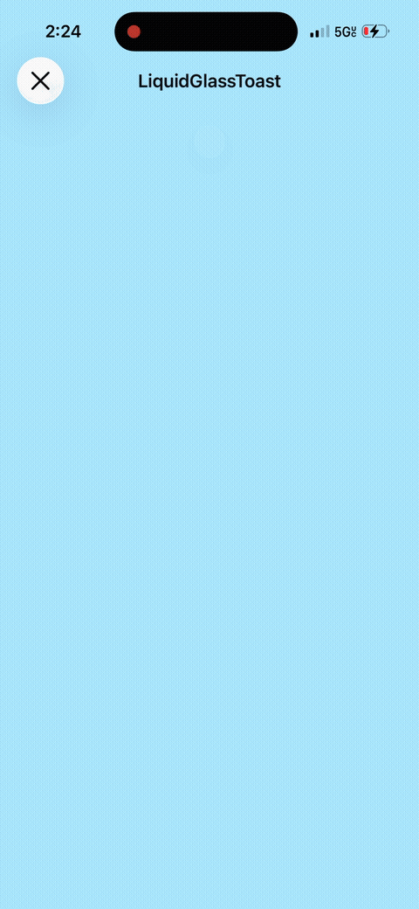

## Beautiful iOS Components

Beautiful, highly customizable, and accessible SwiftUI components with an emphasis on newer tech (liquid glass, etc).

- **Targets**: Xcode 26 / iOS 26 (with graceful fallbacks)
- **Principles**: Defaults first, strong accessibility, composition, API stability
- **Structure**:
  - `Sources/Beautiful_iOS_Components/Components`
  - `Sources/Beautiful_iOS_Components/Styles`
  - `Sources/Beautiful_iOS_Components/Tokens`
  - `Sources/Beautiful_iOS_Components/Utilities`
  - `Examples/DemoApp`
  - `Docs/`

### Standout Components

- **LiquidGlassToast**: a liquid‑glass toast inspired by a water droplet falling on glass.

### Getting Started
Add the package via Swift Package Manager, or open the demo under `Examples/DemoApp`.

### Contributing
See `Docs/CONTRIBUTING.md`. Run SwiftLint/SwiftFormat before committing.
